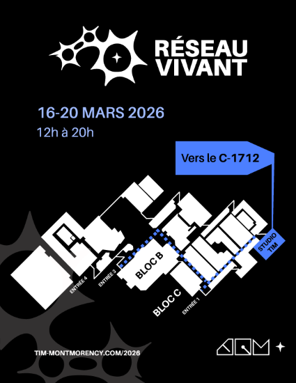
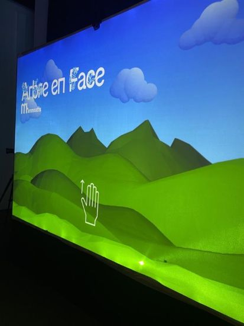
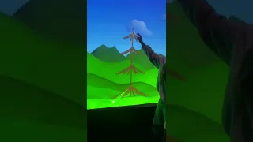
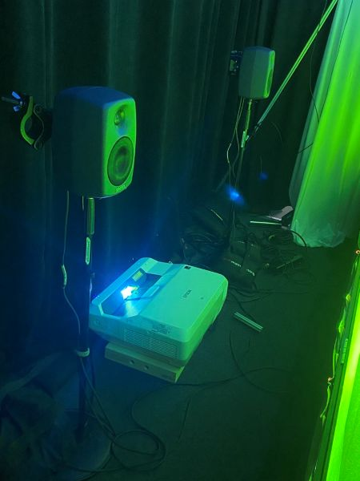
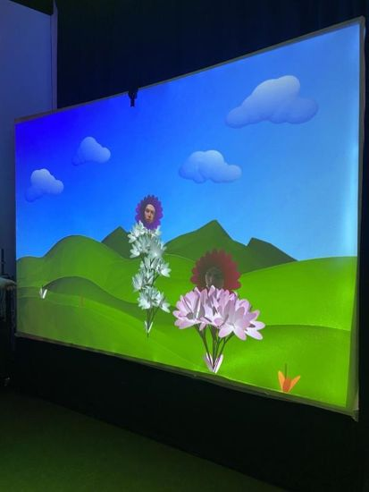

# FICHE DE PRÉSENTATION
# Réseau Vivant

> Affiche prise du [site](https://tim-montmorency.com/2026/#/) créé par les finissantes et finissants de 2026 du programme de Techniques d'intégration multimédia du Collège Montmorency

## Lieu de l'exposition
Grand Studio TIM du Collège Montmorency

## Type d'exposition
temporaire et à l'intérieur

## Date de la visite		
24 février 2026, 17 mars 2026

## Oeuvre observée: Arbre en Face

> Photo prise par Sophia F.

## Artistes
Alexandre Gendron, Mikael Arseneau, Mathieu Willett, Mathis Ghariani, Rafael Angon Dube

## Année de réalisation		
2026

## Description de l'oeuvre 
L'oeuvre est un écosystème numérique où le public peut toucher une toile où seront projetés des arbres et des plantes que chaque individu fera pousser avec ses doigts. Au sommet des arbres apparaissent le visage d'une personne parmi les participants.

## Type d'installation
Installation interactive

> https://youtube.com/shorts/NnNzhEclORM?feature=share

## Mise en espace
En entrant dans le Grand Studio, on aperçoit immédiatement le coté latéral de l'oeuvre en face de nous. L'oeuvre est accotée au mur droit du studio juste en face de l'entrée, servant de surface principale de projection. En avancant de quelques pas, on voit au sol un petit carré indiquant au participant où se placer pour être détecté par une caméra qui va scanner son visage pour qu'elle puisse ainsi apparaître dans la projection, lorsqu'un arbre ou une plante poussera. Finalement, il faut avancer un peu plus et faire face à ce mur pour voir l'entièreté de l'installation.

## Composantes et techniques
- Pinces pour la toile
- toile en splandex
- Peinture et vernis
- lidars
- trépieds
  

> Photo prise par Sophia F.

  
## Éléments nécessaires à la mise en exposition
- Ordinateur de l'école
- Moniteurs
- Clavier
- Souris
- Haut-parleurs
- Caméra pour ordinateur
- Lidars
- Projecteurs
- Toile en spendax
- Pinces pour la toile
- Trépieds
- bc204
- Multiprises électriques
- Rallonges électriques
- Rouleaux de velcro pour fils
- Cables Ethernet
- Transmetteur Cat6
- Recepteur Cat6
- Cables HDMI
- Cables XLR
- Cables USB
- Cables Display Port
- Sac de sable
- Bois
  

## Expérience vécue	

C'était intéressant de voir que, avec mon doigt, je pouvais simuler la croissance de plantes ou d'arbres. Lorsqu'une plante poussait, je pouvais entendre un bruit d'étirement accompagné d'un effet sonore "Wow!" à la fin, lorsque la plante avait atteint sa hauteur maximale et que la fleur arborant un visage apparaissait. Je m'amusais à faire pousser plusieurs arbres en même temps mais d'hauteurs différentes.

> Photo prise par Sophia F.

## Ce qui m'a plu
J'ai vraiment aimé le fait que le dévoilement des fleurs avec les visages était une surprise, on ne sait pas si c'est le nôtre qui sera le prochain à apparaître, et donc avec mes amies, je m'amusais à prédire quel visage allait apparaître avec l'arbre que je faisais pousser. J'ai aussi vraiment apprécié la variété de plantes et d'arbres qui poussaient: il y en avait de toutes les formes, de toutes les couleurs et de toutes les tailles.

## Ce qui ne m'a pas plu
Un point à améliorer dans cette oeuvre serait peut-être de légèrement agrandir les images des visages, car parfois elles n'étaient pas très visibles à cause de la qualité de la photo ou leur taille était trop petite et je n'arrivais à voir c'était le visage à qui.
