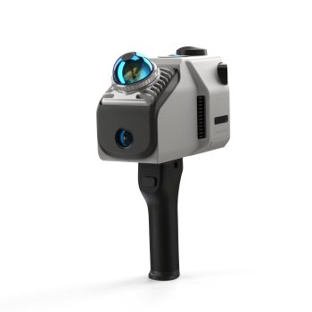

# Palmarès des oeuvres - RÉSEAU VIVANT

## No ordre de préférence: 1
## Titre du projet:	Quand les yeux se croisent	
## Noms des créateurs et créatrices:	
Patricia Nassif, Jade Hébert, Manel Yaya, Edelwyn Ledru, Félix Lavoie
## Installation:

## Schéma de l'installation prévue

> Image prise de la [documentation Github](https://emersiaa.github.io/Quand-les-yeux-se-croisent/#/technique/) de l'équipe
## Mon expérience
L'oeuvre est très belle à observer. Il y a beaucoup de détail et d'éléments de décoration qui ont été pensés, ce qui fait de l'installation une oeuvre très originale et artisitique. Ce n'est pas très évident au début où se placer pour que la caméra nous enregistre, mais lorsque c'est fait, le résultat est très captivant: On voit nos yeux en très grands dans une ou plusieurs des écrans de TV. Par contre, durant ma deuxième visite, j'ai remarqué que des dessins de empreintes de pieds ont été ajoutés au sol pour montrer à l'utilisateur où il doit se positionner, ce qui est une amélioration.

## No ordre de préférence: 	2
## Titre du projet:		Terminal
## Noms des créateurs et créatrices:	
## Installation:

## Schéma de l'installation prévue	
 
> Image prise de la [documentation Github](https://pythons-5.github.io/Terminal/#/technique/) de l'équipe
## Mon expérience avec justification (avant/après l'expérimentation)

## No ordre de préférence: 	3
## Titre du projet:		Symbiose
## Noms des créateurs et créatrices:	
## Installation:

## Schéma de l'installation prévue

> Image prise de la [documentation Github](https://les-chimistes.github.io/symbiose/#/technique/) de l'équipe
## Mon expérience avec justification (avant/après l'expérimentation)		

## No ordre de préférence: 	4
## Titre du projet:		Mission Décollage
## Noms des créateurs et créatrices:	
## Installation:

## Schéma de l'installation prévue

> Image prise de la [documentation Github](https://o-i-g-n-o-n.github.io/Mission-decollage/#/technique/) de l'équipe
## Mon expérience avec justification (avant/après l'expérimentation)		

## No ordre de préférence: 	5
## Titre du projet:		Océan Rouge
## Noms des créateurs et créatrices:	
## Installation:

## Schéma de l'installation prévue

> Image prise de la [documentation Github](https://deux-intelligence.github.io/deux-neurones/#/technique/) de l'équipe
## Mon expérience avec justification (avant/après l'expérimentation)		

## 3 cours du programme incontournables pour créer ce projet	
1- Conception d’une expérience multimédia
2- Objets interactifs et Réalité mixte
3- Traitement audiovisuel

## une composante technologique qui est utilisée dans l'un des projets et que vous ne connaissiez pas.
### Un lidar
Le lidar ou LiDAR (Light Detection And Ranging) est un appareil de télédétection qui utilise des faisceaux laser pour mesurer des distances et des mouvements, et ce, en temps réel. Pour mesurer une distance, le LiDAR calcule le temps qu'a mis la lumière pour revnir. Elle permet ainsi de créer des modèles 3D précis de l'environnement. Elle est surtout utilisée dans des domaines tels que la cartographie et la gestion forestière.

> Information tirée de [Wikipédia](https://fr.wikipedia.org/wiki/Lidar)
