# Palmarès des oeuvres - RÉSEAU VIVANT

## No ordre de préférence: 1
## Titre du projet: QUAND LES YEUX SE CROISENT	
Réalisé par: Patricia Nassif, Jade Hébert, Manel Yaya, Edelwyn Ledru, Félix Lavoie
## Installation:
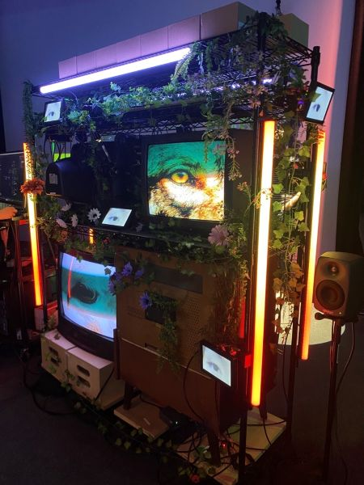
## Schéma de l'installation prévue
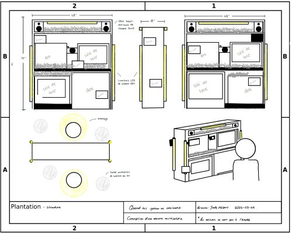
> Image prise de la [documentation Github](https://emersiaa.github.io/Quand-les-yeux-se-croisent/#/technique/) de l'équipe
## Mon expérience
L'oeuvre est très belle à observer. Il y a beaucoup de détail et d'éléments de décoration qui ont été pensés, ce qui fait de l'installation une oeuvre très originale et artisitique. Ce n'est pas très évident au début où se placer pour que la caméra nous enregistre, mais lorsque c'est fait, le résultat est très captivant: On voit nos yeux en très grand dans un ou plusieurs des écrans de TV. Durant ma deuxième visite, j'ai remarqué que des dessins d'empreintes de pieds ont été ajoutés au sol pour montrer à l'utilisateur où il doit se positionner, ce qui est une belle amélioration.      
## No ordre de préférence: 	2
## Titre du projet:		TERMINAL
Réalisé par: Émeryk Bélisle, Elie Daher, Ting Yung Lu Terry, Dana Saavedra-Torrano, Mégane Ranger
## Installation:
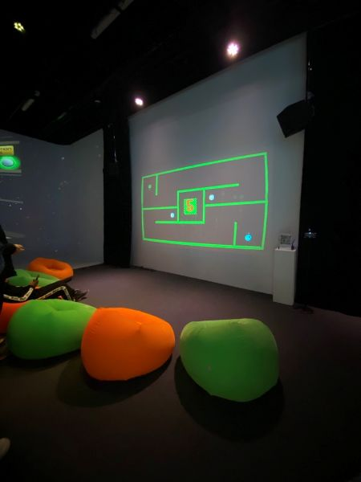
## Schéma de l'installation prévue	
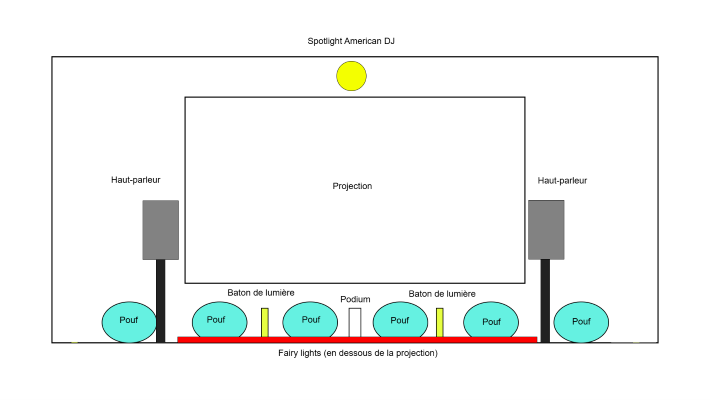 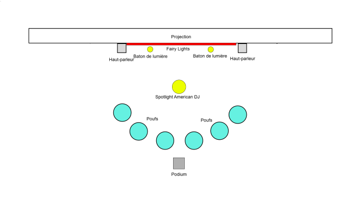
> Image prise de la [documentation Github](https://pythons-5.github.io/Terminal/#/technique/) de l'équipe
## Mon expérience avec justification (avant/après l'expérimentation)
Les chaises de style <<pouf>> m'ont immédiatement attiré l'attention, je n'ai donc pas perdu de temps et je me suis assise sur une d'elles pour commencer le jeu. C'était très confortable, ce qui a rendu mon expérience beaucoup plus relaxante. J'ai aimé le fait qu'on travaille en équipe pour réussir les niveaux, c'était drôle de pointer du doigt le fautif de l'équipe quand on perdait. Par contre, le niveau qu'on jouait se répétait plusieurs fois, même si on l'avait déjà réussi. Pour chaque niveau qu'on jouait, il était répété au moins 5 fois avant de passer au prochain, ce qui a rendu mon expérience au final plus ennuyante.      
## No ordre de préférence: 	3
## Titre du projet:		SYMBIOSE	
Réalisé par: Yannick Chamberland, Benjamin Ferland, Ryan Dufault, Walid Cheour
## Installation:
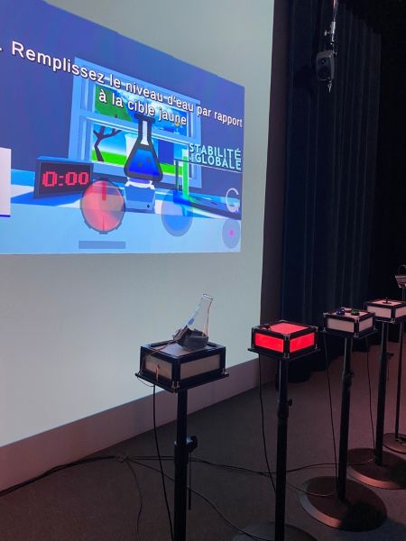
## Schéma de l'installation prévue
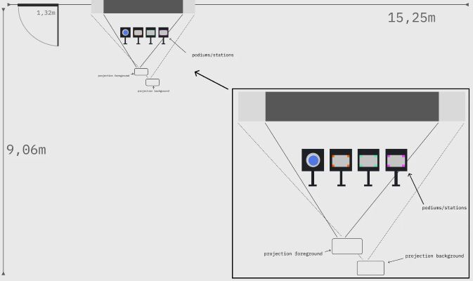
> Image prise de la [documentation Github](https://les-chimistes.github.io/symbiose/#/technique/) de l'équipe
## Mon expérience avec justification (avant/après l'expérimentation)	
Le concept d'expérience scientifique du jeu est génial et le design des différentes composantes est vraiment bien fait et attrayant, les couleurs sont bien choisies, elles sont très vibrantes. J'ai aimé comment les rôles ont été répartis dans des stations différentes, cela m'a fait penser au jeu de pacman que je jouais avec mes amis au cinéma, dont les participants sont disposés de manière très similaire. Il y avait assez d'information pour comprendre le rôle que chaque utilisateur doit remplir, mais pas assez pour comprendre le but final, comment on gagne (est-ce qu'il y a une limite de temps ou non? Faut-il simplement bien accomplir les tâches sans cesse pour <<gagner>>?), et comment la partie se finit. Je pense qu'il devrait y avoir plus de précision à ce sujet.       
## No ordre de préférence: 	4
## Titre du projet:		MISSION DÉCOLLAGE
Réalisé par: Ahmed Kaissoumi, Radhouane Kordan, Justin Montpetit, Thearylou Lach, Jad Saloumi
## Installation:
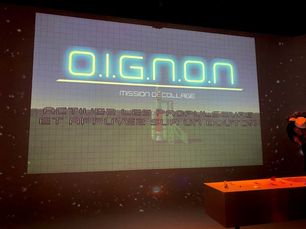
## Schéma de l'installation prévue
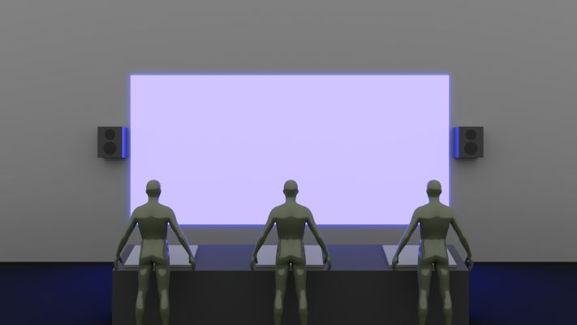
> Image prise de la [documentation Github](https://o-i-g-n-o-n.github.io/Mission-decollage/#/technique/) de l'équipe
## Mon expérience avec justification (avant/après l'expérimentation)		
À première vue, ce projet me semblait vraiment intéressant et amusant à jouer, mais malheureusement, je me suis très vite désintéressée au jeu, car je ne comprenais tout simplement pas comment jouer. Tout d'abord, ce sont les membres de l'équipe qui expliquaient les règles du jeu et comment fonctionnent chacun des boutons. Il n'y avait aucune indication dans la projection sur comment jouer, donc c'était très difficile pour moi de comprendre ce qu'il fallait faire, à chaque nouvelle situation ou problème qui apparaissait, c'était l'équipe qui était la seule à savoir comment procéder pour résoudre les problèmes du jeu, et donc je ne sentais pas que je faisais beaucoup d'efforts et que je n'étais pas réellement en train de jouer.      
## No ordre de préférence: 	5
## Titre du projet:		OCÉAN ROUGE
Réalisé par: Amira Tounekti, Kristy Moussally
## Installation:
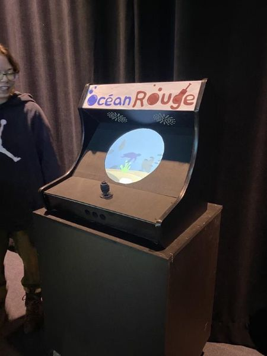
## Schéma de l'installation prévue
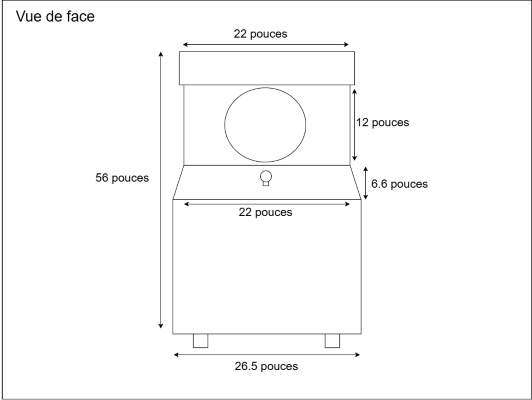
> Image prise de la [documentation Github](https://deux-intelligence.github.io/deux-neurones/#/technique/) de l'équipe
## Mon expérience avec justification (avant/après l'expérimentation)		
J'aime le concept du jeu, c'était amusant de manipuler le joystick pour ramasser les déchets. Cependant, le niveau de difficulté n'augmente jamais, il n'y a pas de fin au jeu, ce qui était ennuyant selon moi. J'aurais aimé qu'il y ait plus de niveaux avec des buts plus spécifique pour que l'expérience varie un peu plus d'une partie de jeu à une autre.      
## 3 cours du programme incontournables pour créer ce projet	
- [ ] Conception d’une expérience multimédia
- [ ] Objets interactifs et Réalité mixte
- [ ] Traitement audiovisuel   

## Nouvelle composante technologique qui est utilisée dans l'un des projets et que j'ai apprise.
### Un lidar (Utilisé dans le projet << Arbre en Face >>)
Le lidar ou LiDAR (Light Detection And Ranging) est un appareil de télédétection qui utilise des faisceaux laser pour mesurer des distances et des mouvements, et ce, en temps réel. Pour mesurer une distance, le LiDAR calcule le temps qu'a mis la lumière pour revnir. Elle permet ainsi de créer des modèles 3D précis de l'environnement. Elle est surtout utilisée dans des domaines tels que la cartographie et la gestion forestière.   

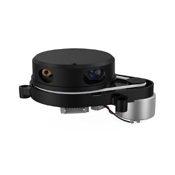
> Information tirée de [Wikipédia](https://fr.wikipedia.org/wiki/Lidar) et photo prise de [tiendamia.com](https://tiendamia.com.ec/p/amz/b0b77d849m/eai-rplidar-x4-pro-lidar-2d-360-degree-lidar-sensor)
