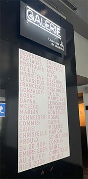
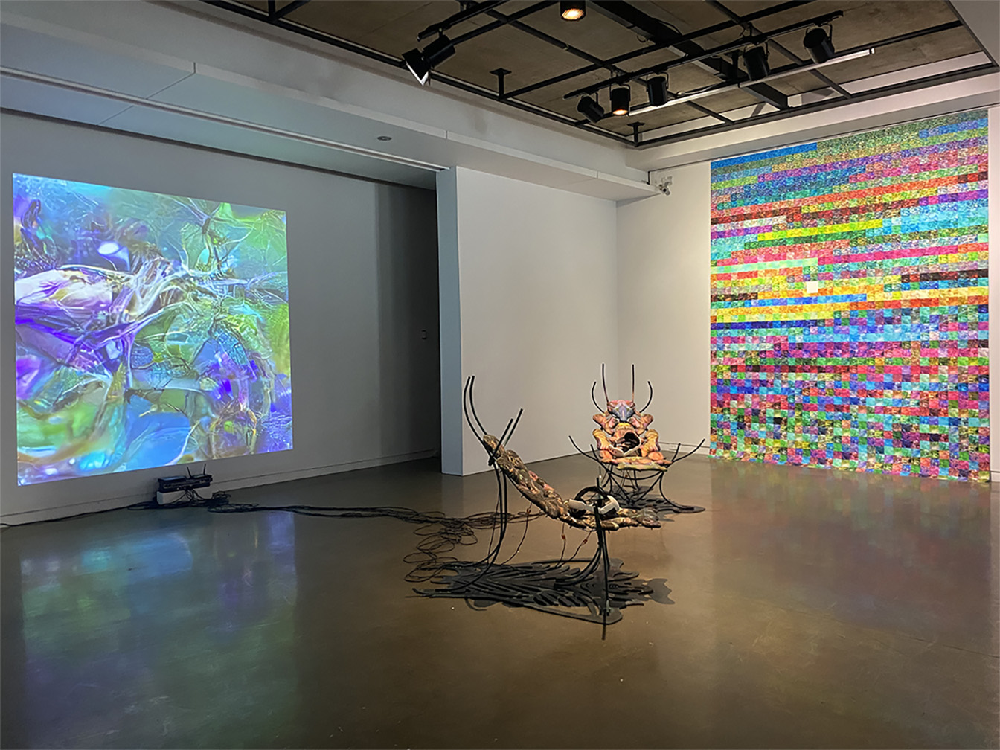
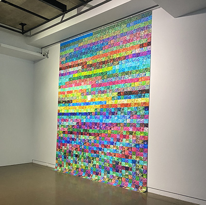
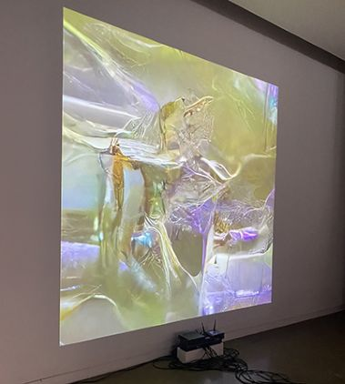
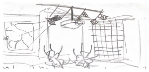

# FICHE DE PRÉSENTATION
# Devenirs partagés. Pratiques de l'IA	

## Lieu de l'exposition
Centre d'exposition (Galerie) de l'Université de Montréal

## Type d'exposition
temporaire et à l'intérieur

## Date de la visite		
30 janvier 2026

## Oeuvbre observée: Techno-Compost 01 et 02

## Artiste
Marie-Ève Levasseur

## Année de réalisation		
2025

## Description de l'oeuvre 
Les outils de l'IA générative produisent à un rythme effréné des milliers d'images, dont la plupart deviennent des déchets numériques, traces d'une énergie excédentaire. C'est à partir de ce constat que Marue-Ève Levasseur a imaginé une spéculation en réalité virtuelle où prend forme le techno-compost. Après avoir expérimenté différents modèles d'IA, l'artiste conçoit ce cycle dans lequel les images-détritus se fragmentent et se dissolvent pour mieux se régénérer en d'autres formes, nourries par la matière numérique désintégrée à l'état de bruit visuel aléatoire, comparable à la neige statique d'un écran télé. Puis, ce lieu invisible où les apprentissages du modèle se condensent avant d'émerger en nouvelles formes, qu'on appelle l'espace latent des modèles d'IA, vient agir véritablement tel un jardin. Dans ce terreau, les images et leurs particules se (re)composent et la prolifération se mue en un rythme plus organique. L'artiste invite ainsi à s'immerger dans cette dynamique symbiotique, esquissant les possibles d'un univers numérique plus lent, attentif et fertile que productif.

## Type d'installation 

> Installation immersive de réalité virtuelle et installation contemplative

## Mise en espace

L'oeuvre a été placée dans le coin droit de la pièce, elle occupe des segments des deux murs qui forment ce coin. L'impression sur papier est affichée sur le mur du côté droit, alors que la projection est affichée sur le mur au fond, donc en face de l'entrée de la gallerie (On peut l'observer immédiatement en entrant dans la pièece). Finalement, les chaises ainsi que les casques de RV sont situés entre ces deux murs.

## Composantes et techniques
- Deux chaises avec une impression numérique sur le tissu
- Deux casques de RV
- Impression numérique sur papier démontrant les échantillons d'entraînement d'un modèle inconditionnel de diffusion
  
## Éléments nécessaires à la mise en exposition
Éléments nécessaires à la mise en exposition	Éléments de mise en exposition (il est possible d'utiliser des images tirées de sites internet pour faciliter la compréhension si les photos prises ne sont pas claires)	Liste des éléments nécessaires à la mise en exposition (ce que le musée a mis en place pour que l'oeuvre ou le dispositif soit exposé (socle, caisson, bancs, cache-fil, crochets, sacs de sable, câbles, herses, projecteurs, éléments de signalisation...)
Expérience vécue	Posture du visiteur ou gestes de l'interacteur 🎥 possibilité d'intégrer de courts vidéos pour documenter les actions de l'oeuvre ou du dispositif ou l'interactivité avec l'oeuvre ou le dispositif	Texte qui explique ce qui est attendu du visiteur ou de l'interacteur. Où et comment se positionne-t-il/elle? Que faut-il faire? Comment réagit l'oeuvre ou le dispositif (si interactivité)? Plus personnellement, description de l'expérience que l'oeuvre ou le dispositif vous a fait vivre.

❤️ Ce qui vous a plu, vous a donné des idées	Éléments pertinents	Texte à rédiger qui présente un ou des aspects inspirants, avec justifications détaillées (pourquoi est-ce que cela vous a plus/ vous a donné des idées ?

🤔 Aspect que vous ne souhaiteriez pas retenir pour vos propres créations ou que vous feriez autrement	Éléments pertinents	Texte à rédiger qui présente un ou des aspects que vous ne retiendriez pas ou feriez autrement, avec justifications détaillées (pourquoi? comment?)
Références		identifier l'auteur.e des images et photos, inclure les hyperliens vers les sites consultés

À partir des aspects notés et photographiés, créer une fiche de présentation des informations bien structurée (titres, sous-titres, cohérence de la présentation, intégration soignée d'appuis visuels...)
 Intégrer les informations demandées dans la fiche créée
 Faire des recherches complémentaires pour enrichir l'information (ex : site de l'exposition, site web de l'artiste, de la firme recherche sur les composantes...)
 Élaborer des justifications lorsque nécessaire (le pourquoi)
 Insérer les sources de vos informations et les crédits photos
