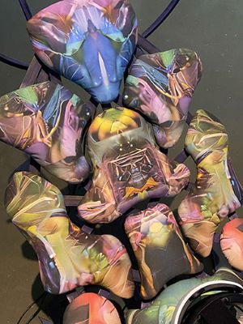
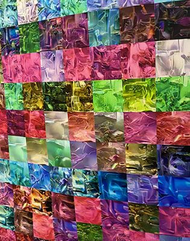
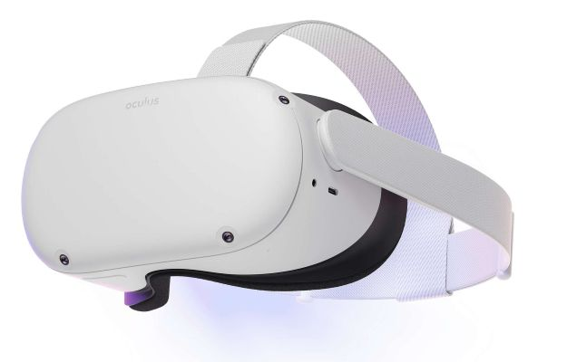
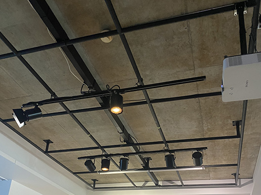
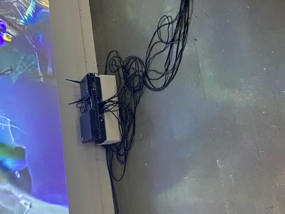
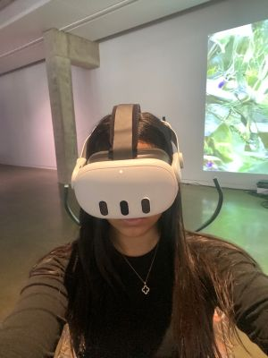

# FICHE DE PRÉSENTATION
# Devenirs partagés. Pratiques de l'IA	

## Lieu de l'exposition
Centre d'exposition (Galerie) de l'Université de Montréal

## Type d'exposition
temporaire et à l'intérieur

## Date de la visite		
30 janvier 2026

## Oeuvbre observée: Techno-Compost 01 et 02

## Artiste
Marie-Ève Levasseur

## Année de réalisation		
2025

## Description de l'oeuvre 
Les outils de l'IA générative produisent à un rythme effréné des milliers d'images, dont la plupart deviennent des déchets numériques, traces d'une énergie excédentaire. C'est à partir de ce constat que Marue-Ève Levasseur a imaginé une spéculation en réalité virtuelle où prend forme le techno-compost. Après avoir expérimenté différents modèles d'IA, l'artiste conçoit ce cycle dans lequel les images-détritus se fragmentent et se dissolvent pour mieux se régénérer en d'autres formes, nourries par la matière numérique désintégrée à l'état de bruit visuel aléatoire, comparable à la neige statique d'un écran télé. Puis, ce lieu invisible où les apprentissages du modèle se condensent avant d'émerger en nouvelles formes, qu'on appelle l'espace latent des modèles d'IA, vient agir véritablement tel un jardin. Dans ce terreau, les images et leurs particules se (re)composent et la prolifération se mue en un rythme plus organique. L'artiste invite ainsi à s'immerger dans cette dynamique symbiotique, esquissant les possibles d'un univers numérique plus lent, attentif et fertile que productif.

## Type d'installation 

> Installation immersive de réalité virtuelle et installation contemplative

## Mise en espace

L'oeuvre a été placée dans le coin droit de la pièce, elle occupe des segments des deux murs qui forment ce coin. L'impression sur papier est affichée sur le mur du côté droit, alors que la projection est affichée sur le mur au fond, donc en face de l'entrée de la gallerie (On peut l'observer immédiatement en entrant dans la pièece). Finalement, les chaises ainsi que les casques de RV sont situés entre ces deux murs.

## Composantes et techniques
- Deux chaises avec une impression numérique sur le tissu
- Deux casques de RV
- Impression numérique sur papier démontrant les échantillons d'entraînement d'un modèle inconditionnel de diffusion
  

  
## Éléments nécessaires à la mise en exposition
- Projecteur
- Plafonnier avec des ampoules de type ''spot''
- Cables à haut-parleur
- Transducteur
- Ordinateur
- Modem

  

## Expérience vécue	

Posture du visiteur ou gestes de l'interacteur 🎥 possibilité d'intégrer de courts vidéos pour documenter les actions de l'oeuvre ou du dispositif ou l'interactivité avec l'oeuvre ou le dispositif	Texte qui explique ce qui est attendu du visiteur ou de l'interacteur. Où et comment se positionne-t-il/elle? Que faut-il faire? Comment réagit l'oeuvre ou le dispositif (si interactivité)? Plus personnellement, description de l'expérience que l'oeuvre ou le dispositif vous a fait vivre.
Pour bien observer les oeuvres sur les murs, il faut se déplacer autour des chaises. Pour l'expérience immersive, il suffit de s'assoir sur une des chaises et de poser le casque RV sur la tête. On voit alors un monde virtuel qui correspond à l'espace latent. On peut également placer les mains devant les capteurs du casque RV pour intéragir ensuite avec les images de l'expérience; on peut les toucher, les pincer pour les bouger de place, etc. On rentre ainsi dans un monde coloré et abstrait qui ressemble à un jardin.

## Ce qui m'a plu
Mettre en exposition deux oeuvres de même nature de façon différente. J'ai apprécié le fait que les oeuvres sur les murs n'étaient pas les deux des projections, mais plutôt une d'entre elles est une projection et l'autre est une impression sur papier. Cela rend la mise en exposition des éléments plus originale et moins ennuyante. En effet, j'ai été très rapidement captivée par les dizaines d'images générées présentées comme une mozaĩque, et j'ai aussi aimé le fait qu'on mette en évidence une image toute seule avec la projection, ce qui permet de voir plus attentivement les détails de l'image.

## Ce qui ne m'a pas plu
Références		identifier l'auteur.e des images et photos, inclure les hyperliens vers les sites consultés
Dans l'aspect de sécurité, j'aurais mieux organisé les cables qui étaient éparpillés et un peu entremêlés par terre, car elles passent par le chemin utilisé pour se déplacer dans l'exposition et pourraient engendrer des accidents si quelqu'un trébuche sur les fils, par exemple. En plus, leur présence assez visible n'est pas nécéssairement attrayante, donc j'aurais utilisé des chache-fil pour mieux organiser l'espace et ne pas donner trop d'attention aux cables.
