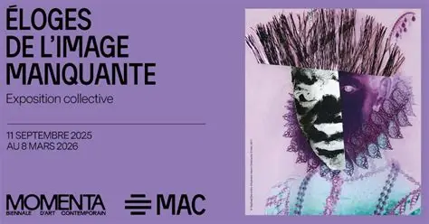
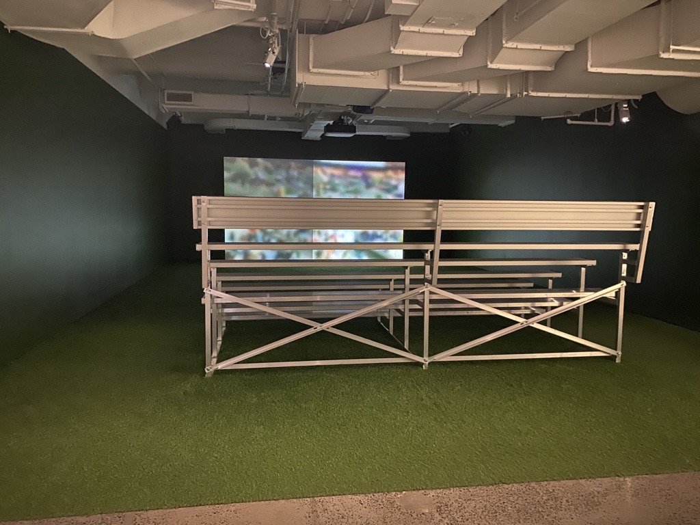
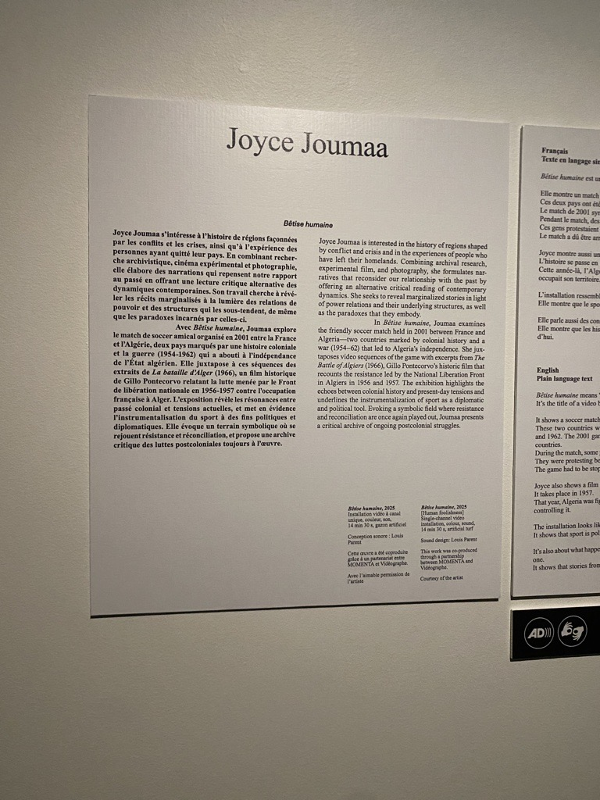
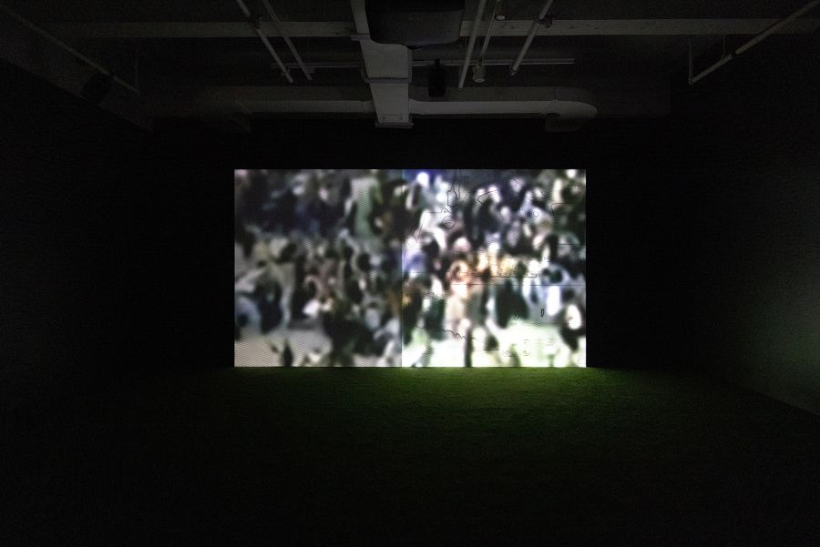
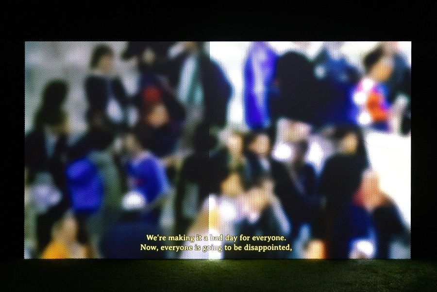
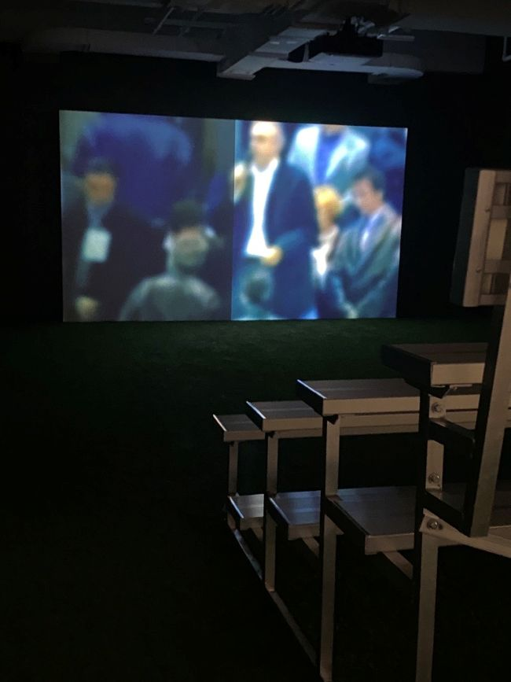

# FICHE DE PRÉSENTATION
# Éloges de l'image manquante

> [Affiche de l'exposition prise du compte de MAC sur Facebook](https://www.facebook.com/events/1469117820907519/)

## Lieu de l'exposition
MAC Musée d'art contemporain à Place Ville-Marie, Montréal

## Type d'exposition
temporaire et à l'intérieur

## Date de la visite		
22 février 2026

## Oeuvre observée: Bêtise humaine

> Photo prise par Sophia F.

## Artiste
Joyce Joumaa

## Année de réalisation		
2025

## Description de l'oeuvre 
L'oeuvre est un court film mettant en scène des images du match de soccer en 2001 entre la France et l'Algérie, en juxtaposition avec des scènes du film *La bataille d'Alger* (1966). Cette oeuvre met en lumière <<les échos entre l’histoire coloniale et les tensions contemporaines et [révèle] l’instrumentalisation du sport comme outil diplomatique et politique>> (momentabiennale.com). L'installation ressemble à un terrain de soccer avec des estrades pour s'assoir et un sol en gazon synthétique. Avec cette oeuvre, Joyce Joumaa montre que les histoires du passé ont encore des effets aujourd'hui.

## Type d'installation
Installation contemplative et immersive

> Photo prise par Sophia F.

> Photo prise du site web de Momenta

## Mise en espace
L'oeuvre est placée juste à gauche de l'entrée de l'exposition complète. Lorsqu'on tourne à gauche, on voit d'abord un mur qui cache la majorité de l'oeuvre, il faut passer soit par la gauche, soit par la droite de ce mur pour se diriger vers l'oeuvre. On voit alors un segment de terrain synthétique avec de grandes estrades en alluminium au centre. Au fond et accoté sur le mur se trouve un grand écran où joue la vidéo mettant en scène un match de soccer. La pièce est ouverte et plongée dans le noir: La seule source de lumière présente est celle du film.

## Composantes et techniques
- Gazon articifiel
- Installation vidéo à canal unique
  

> Photo prise du site web de Momenta

  
## Éléments nécessaires à la mise en exposition
- Estrades en aluminium soudé
- Projecteur
- Haut-parleurs
- Cables à haut-parleur
- Cables d'alimentation
- Surface de projection
  

## Expérience vécue	

Dès que j'ai posé le pied sur le terrain de gazon synthétique, je me suis tout de suite sentie transportée dans un univers de soccer. En m'assoyant sur les estrades, je me suis cru en train d'assister à un vrai match de soccer. J'ai ensuite pu assister à um mélange de scènes sportives avec des scènes plus violentes et dramatiques. Pendant que les scènes de guerre jouaient, je pouvais entendre une musique très dramatique qui mettait beaucoup de suspense, c'est comme si j'étais dans les lieux de la guerre en train de voir de mes propres yeux ce qui se passait. Cette partie du film était beaucoup plus dure à voir.

> Photo prise par Sophia F.

## Ce qui m'a plu
J'ai apprécié que les scènes du match et celles du film sur la Bataille d'Alger étaient juxtaposées et n'étaient pas projetées de la même façon. Par exemple, pour les scènes de guerre, on ne voyait que les contours des personnes qui bougaient, et il n'y avait pas d'autre couleurs. Il y avait aussi des moments ou toute la vidéo était graineuse ou floue, ce qui donnait une touche plus unique à l'oeuvre. Ce mélange de textures m'a vraiment plu.

## Ce qui ne m'a pas plu
La ligne qui séparait la surface de projection me dérangeait un peu, je ne comprends pas trop son utilité dans la projection de la vidéo et je trouve qu'elle était de trop.
