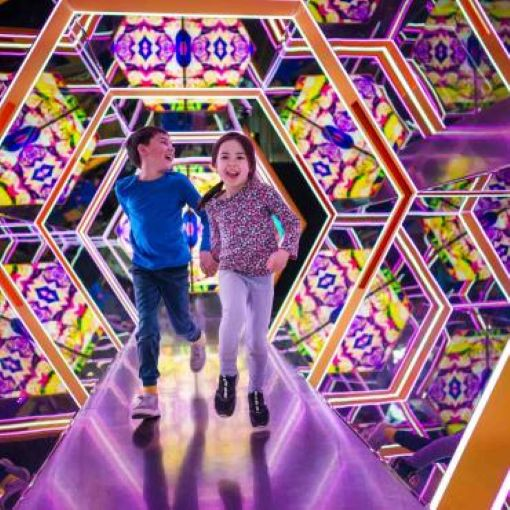
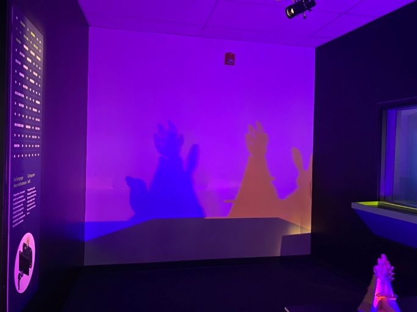
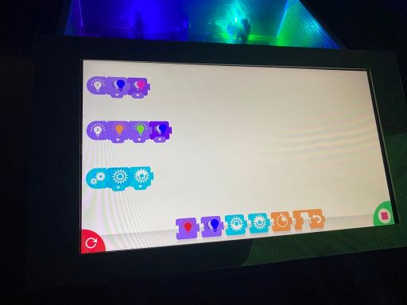
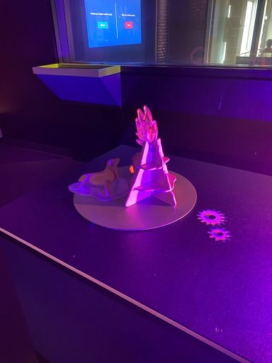
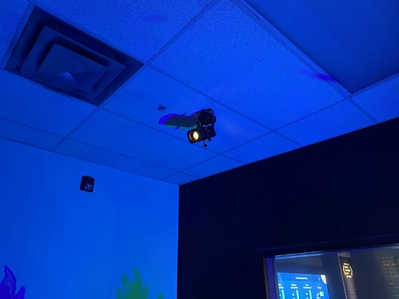
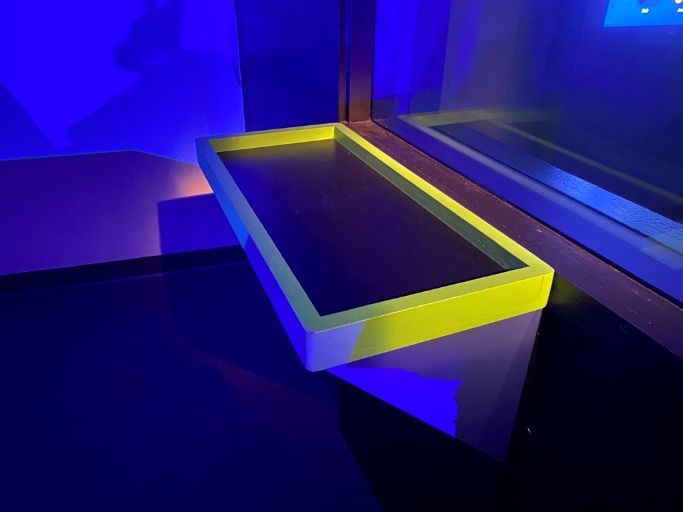
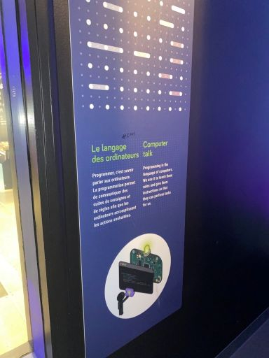

# FICHE DE PRÉSENTATION
# Explore - La science en grand

> Photo de l'installation du kaléidoscope par Benoit Rousseau (2023)

## Lieu de l'exposition
Centre des sciences de Montréal

## Type d'exposition
Permanente, à l'intérieur

## Date de la visite		
1er avril 2026

## Oeuvre observée: Théatre d'ombres

> https://youtube.com/shorts/49Lz77gI20A?feature=share

## Artistes
UBISOFT

## Année de réalisation		
2019

## Description de l'oeuvre 
Le théatre d'ombres est une installation qui permet d'expérimenter la programmation afin de faire bouger des objets et de changer les couleurs de lumières pour personnaliser les ombres qui seront créées sur le mur. Le language de programmation est très similaire à celui du site <<Scratch>>, qui est un logiciel destiné à apprendre aux jeunes les bases de la programmation d'animations. Il faut essentiellement déplacer des blocs contenant différentes instructions de code et les assembler selon l'ordre voulu. Ensuite, il suffit de cliquer sur le bouton <<Démarrer>> pour que l'animation des objets et des lumières se produise. Cette méthode de glisser-déposer des blocs de code rend la programmation plus visuelle et ludique, ce qui la rend plus accessible pour les enfants. En effet, cette installation est destinée aux enfants de 6 à 12 ans. C'est une excellente façon d'utiliser la programmation pour créer quelque chose d'artistique et de découvrir l'art des ombres sur des murs!

## Type d'installation
Interactive et immersive

## Mise en espace
L'installation est située dans un local fermé, plongé dans le noir. Le local est situé au fond de la salle de l'exposition en entier, environ au milieu de celle-ci. À côté du local et du côté droit se trouve une autre installation de programmation (Animation d'une voiture à l'aide de l'IA), et les deux locaux sont connectées par une porte commune qui permet à un de se déplacer rapidement d'un local à un autre. Sur le mur de gauche, il y a trois grandes fenêtres verticales qui donnent à la vue de l'extérieur avec tout le reste des oeuvres et sur la droite, une grande fenêtre horizontale qui nous permet de voir ce que les autres programment dans l'autre local. En entrant, on voit un écran de taille moyenne qui fait face au mur opposé de celui où les ombres seront projetées. Ensuite, derrière l'écran se trouve une table où est posé la machine avec les ampoules pour projeter les lumière, et un peu plus loin sur cette table se trouvent les différents objets en bois sur une petite tablette en forme de cercle qui tourne. À gauche, juste à côté de la fenêtre, se trouve un panneau qui décrit ce que la programmation fait et à quoi ça sert, et à droite, en dessous de l'autre fenêtre, on voit une étagère. On peut y déposer les objets en bois qu'on ne veut pas utiliser pour créer les ombres.

## Composantes et techniques
- 3 objets en bois (2 animaux et un arbre)
- Un écran tactile de taille moyenne
- Boîtier d'ordinateur connecté à l'écran
- 2 ampoules
- Cables
- Table (Plateforme)
- Petite tablette en bois en forme de cercle

  

> Photo prise par Sophia F.

> Photo prise par Sophia F.

  
## Éléments nécessaires à la mise en exposition
- Une lumière de type <<spotlight>>
- Une étagère en bois
- Le mur du local

> Photo prise par Sophia F.

> Photo prise par Sophia F.  

## Expérience vécue	
En entrant dans le local, j'ai tout de suite remarqué l'écran et les animaux en bois devant. Je me suis questionnée sur ce qu'il fallait faire, puisque je n'ai pas vraiment assisté à du théatre d'ombres auparavant: je ne savais donc pas à quoi m'attendre, c'était toute une surprise. J'ai commencé à manipuler les blocs d'instructions sans trop savoir ce que j'allais faire. J'ai ensuite assemblé quelques blocs ensemble, et lorsque j'ai appuyé sur le bouton de démarrage, j'ai été surprise de voir que les ampoules avaient changé de couleurs et qu'on voyait les ombres des objets en rotation, et tout cela était projeté sur le mur. Le résultat était captivant à observer: c'était un jeu d'ombre que j'avais par moi-même programmé. J'ai donc continué à essayer des nouvelles combinaisons de blocs pour créer d'autres séquences. C'était très amusant de programmer, le système de blocs m'a fait penser à mon enfance quand on m'avait appris à utiliser le language de programmation <<scratch>>, c'était un très bon souvenir.

> Photo prise par Sophia F.

## Ce qui m'a plu
La programmation est simple facile à utiliser, surtout pour les jeunes enfants puisqu'ils sont le public-cible. C'est une installation qui est selon moi très éducative et qui montre aux enfants ce qu'on peut faire avec les ordinateurs et leur donne la chance de pratiquer la programmation. J'aime aussi le fait qu'on peut déplacer les objets comme on veut sur la plateforme en cercle pour modifier légèrement l'image sur le mur.

## Ce qui ne m'a pas plu
J'aurais quand-même voulu qu'il y ait plus de choix de formes d'ombres qu'on puisse faire, car il n'y avait que 3 objets et donc 3 ombres possibles: Un lapin, un phoque et un arbre. Je pense qu'ajouter plus d'objets variés donnerait place à plus d'imagination chez les enfants. En effet, ils s'amuseraient à créer une scène avec les objets et à compléter le tout avec un choix de couleur d'éclairage réfléchi.
