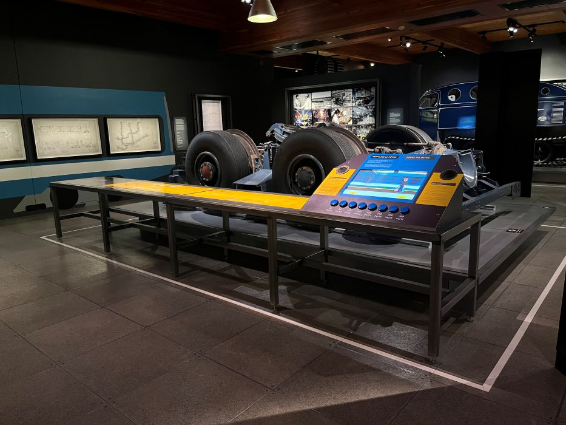

# CONFÉRENCE EN LIGNE AVEC MARTIN BOUCHER - MUSÉE DE L'INGÉNIOSITÉ J.ARMAND-BOMBARDIER
## De la réalisation à la mise en exposition des dispositifs multimédia

J'ai eu l'occasion d'assister à une conférence très enrichissante et présentée par Martin Boucher, un technicien multimédia pour le musée d'ingéniosité J.Armand-Bombardier, situé à Valcourt. Durant cette conférence, j'ai essentiellement appris le processus de réalisation, de fonctionnement et de mise en exposition de dispositifs multimédia dans les salle d'exposition de son musée.

Dans un premier temps, Martin Boucher a présenté son parcours professionnel et son rôle au sein du Musée de l’ingéniosité J.‑Armand‑Bombardier, où il travaille comme technicien multimédia depuis 2009. Il a décrit les différentes zones d’intérêt du musée, notamment les espaces d’exposition, les spectacles et les activités éducatives offertes aux groupes scolaires, comme le Fab Lab. Il a également souligné l’importance de la Fondation Bombardier, qui soutient la mission éducative du musée et contribue à créer des liens culturels avec la communauté. Il a ensuite détaillé ses responsabilités quotidiennes, qui incluent le soutien informatique aux usagers, l’entretien des appareils et la création de contenus numériques, par exemple pour la publicité. 

M. Boucher a ensuite proposé un jeu brise‑glace portant sur les connecteurs, rappelant que la majorité des dispositifs multimédias reposent sur des branchements techniques souvent complexes. La conférence a également abordé les domaines connexes au multimédia, tels que l’informatique, la gestion de projets, la programmation ou encore la production audiovisuelle. Martin Boucher a expliqué que chaque installation nécessite de comprendre les besoins du client, de choisir les bons supports de projection, de réfléchir à l’intégration du son ou à l’interactivité, et de tenir compte de l’éclairage et de l’optique selon les matériaux exposés. 

Enfin, il a présenté plusieurs exemples concrets de projets réalisés au musée, notamment une exposition dans le garage mettant en valeur un véhicule Bombardier des années 1940. À travers ces exemples, il a montré comment les choix techniques tels que la disposition des haut‑parleurs ou la qualité de la projection influencent la perception du visiteur et nécessitent souvent des compromis entre contraintes techniques et budget, majoritairement imposés par les demandes des clients.

Après avoir répondu aux questions de quelques élèves, il a poursuivi sa présentation en montrant un exposition du musée de l'ingéniosité qui montrait un moteur et des roues de train de métro, car il faut savoir que c'est Bombardier qui avait construit l'ancien métro de Montréal, pour l'Expo 67. Il explique ensuite comment la mélodie qu'on entend jouer dans les haut-parleurs du métro a été créée. Tout d'abord, ce bruit est le même que celui de l'alimentation du moteur qu'on devait couper en plusieurs séquences et donc, on commençait par une fréquence qui était agréable aux oreilles, et cette fréquence augmentait graduellement. Dans l'exposition, on peut interagir avec des boutons pour essayer de recréer cette fameuse mélodie. Il précise ensuite que le dispositif permettant de recréer la mélodie est assez bas et est présenté comme un jeu pour attirer l'attention des enfants et rendre leur visite plus amusante.

> Photo prise par François Sylvie

Martin Boucher a finit la présentation en disant qu'il est important de faire en sorte que les dispositifs multimédia soient le plus accessible possible, afin que n'importe qui puisse en profiter entièrement. Par exemple, adapter l'hauteur des dispositifs pour que les enfants puissent aussi participer, rendre l'audio d'un dispositif accessible en intégrant plusieurs langues avec lesquelles on peut écouter l'audio, etc.

Pour conclure, j’ai particulièrement apprécié cette conférence, car elle expliquait concrètement le travail en multimédia au sein d’un musée. Les explications de Martin Boucher, qui sont claires et appuyées de plusieurs exemples, m’ont permis de mieux comprendre la diversité des tâches liées à son métier, allant du soutien technique à la création de dispositifs multimédia. J’ai aussi trouvé très enrichissant de voir comment des choix techniques comme l’éclairage, l’audio ou l’interactivité influencent directement l’expérience du visiteur. Enfin, l'insistance de M. Boucher sur l’accessibilité m’a semblé essentielle: elle montre qu'il y a une grande importance et volonté de rendre la culture et la technologie accessibles à tous, peu importe l’âge ou les capacités. Cette approche humaine et réfléchie m'a semblé très inspirante.
